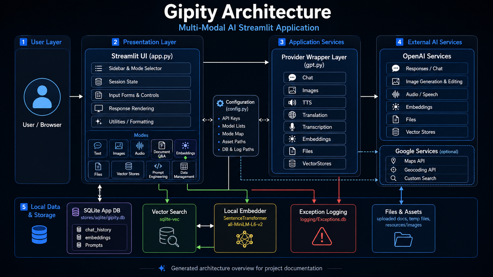

# Architecture

## Overview

Gipity is organized around a Streamlit application shell, a configuration layer, provider wrappers,
local storage, and static documentation generation.

## System Structure

    Streamlit UI
        |
        |-- app.py
        |     |-- Session state initialization
        |     |-- Mode rendering
        |     |-- Upload handling
        |     |-- Local retrieval helpers
        |     |-- Display helpers
        |     |-- Token tracking
        |     |-- Workflow orchestration
        |
        |-- config.py
        |     |-- Environment-variable helpers
        |     |-- Paths
        |     |-- API keys
        |     |-- Model lists
        |     |-- UI constants
        |     |-- Prompt and workflow constants
        |
        |-- gpt.py
              |-- GPT base wrapper
              |-- Chat
              |-- Images
              |-- Embeddings
              |-- TTS
              |-- Transcription
              |-- Translation
              |-- Files
              |-- VectorStores

## Application Shell

`app.py` is the main Streamlit entry point. It coordinates page setup, session state, user controls,
workflow routing, output rendering, document handling, token tracking, and integration with provider
wrappers.

Because `app.py` is a Streamlit runtime module, it is documented manually in this documentation site
rather than imported directly by `mkdocstrings`.

## Configuration Layer

`config.py` centralizes paths, API keys, model lists, prompt constants, logging settings, database
paths, and other application-level defaults.

This module is suitable for `mkdocstrings` API documentation.

## Provider Wrapper Layer

`gpt.py` contains the OpenAI provider wrapper classes used by the application. These wrappers
coordinate request construction, provider calls, response capture, validation, and error logging for
GPT-backed workflows.

This module is suitable for `mkdocstrings` API documentation.

## Local Storage

Gipity uses local SQLite-backed storage for application data such as prompts, history, embeddings,
and other workflow records where implemented.

## Documentation Generation Model

MkDocs builds the static documentation site from Markdown files under `docs/`.

`mkdocstrings` imports selected Python modules and renders their Google-style docstrings into API
reference pages.

The initial API reference strategy is:

    Document with mkdocstrings:
        config.py
        gpt.py

    Document manually:
        app.py

## Import-Safety Rule

A module should only be documented directly with `mkdocstrings` when it is safe to import during a
documentation build.

A module may be risky to import when it:

- Starts a Streamlit app at import time.
- Requires credentials during import.
- Calls external APIs during import.
- Loads large local models during import.
- Opens files, sockets, or databases during import.
- Mutates application state during import.

## No Source Refactor Required

This documentation approach does not require reorganizing Gipity source code.

The working application can remain as-is while the documentation layer is added beside it.