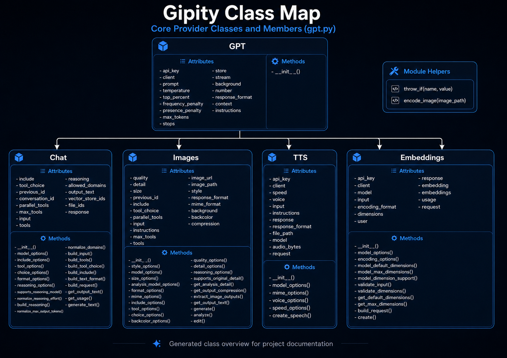
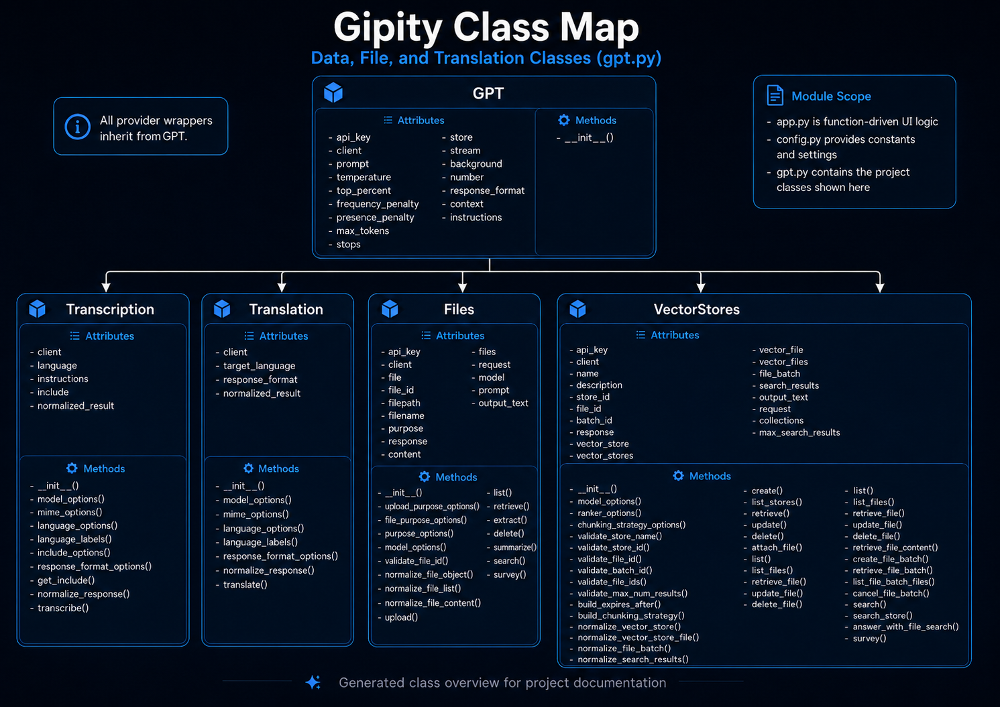

# User Guide
## Class Map

___

## Launch Gipity

Run the application from the repository root:

    python -m streamlit run app.py

The application starts as a Streamlit web application. Use the sidebar to select the active workflow
mode and configure model or workflow settings.

## Application Modes

| Mode               | Purpose                                                                            |
|--------------------|------------------------------------------------------------------------------------|
| Text               | Generate text, reasoning outputs, structured responses, and tool-assisted answers. |
| Images             | Generate, edit, or analyze images.                                                 |
| Audio              | Transcribe audio, translate audio, or generate speech from text.                   |
| Embeddings         | Convert text into vector embeddings and inspect embedding output.                  |
| Document Q&A       | Ask questions against local uploads, file IDs, or vector-store-backed content.     |
| Files              | Manage OpenAI Files API assets.                                                    |
| Vector Stores      | Manage OpenAI vector stores and file-search workflows.                             |
| Prompt Engineering | Create, edit, search, and reuse prompt templates.                                  |
| Data Management    | Inspect and manage local SQLite-backed application data.                           |

## Typical Workflow

1. Start the Streamlit application.
2. Select the active mode from the sidebar.
3. Choose the model or workflow-specific options.
4. Enter prompt, file, image, audio, or document input.
5. Run the selected operation.
6. Review generated output, retrieved sources, usage metrics, tables, files, or exports.

## Text Workflows

Use Text mode for chat-style prompting, drafting, reasoning, structured output, tool-assisted
responses, and retrieval-augmented answers.

Common controls include:

- Model selection.
- System instructions.
- Prompt input.
- Temperature and sampling settings where supported.
- Maximum output tokens.
- Tool selection.
- Include fields.
- Response format.
- Conversation or previous response identifiers.

## Image Workflows

Use Images mode for image generation, editing, and visual analysis.

Common controls include:

- Image model.
- Analysis model.
- Prompt or image instruction.
- Size.
- Quality.
- MIME type.
- Background.
- Detail.
- Compression.
- Uploaded image context.

## Audio Workflows

Use Audio mode for transcription, translation, and text-to-speech workflows.

Common controls include:

- Audio task.
- Uploaded audio file.
- Transcription model.
- Translation model.
- Text-to-speech model.
- Voice.
- Language.
- Rate or speed.
- Output audio playback or download controls where available.

## Embeddings Workflows

Use Embeddings mode to convert text into vector representations.

Common controls include:

- Embedding model.
- Input text.
- Chunk size.
- Chunk overlap.
- Encoding format.
- Optional dimensions where supported.
- Metrics and dataframe output.

## Document Q&A Workflows

Document Q&A supports document-grounded answers from one or more document sources.

| Source                 | Description                                                                     |
|------------------------|---------------------------------------------------------------------------------|
| Local Upload           | Extracts text from local files, chunks content, and retrieves relevant context. |
| OpenAI File ID         | Uses an uploaded OpenAI file reference where supported.                         |
| OpenAI Vector Store ID | Uses OpenAI vector-store file search for grounded responses.                    |

## Files Workflows

Files mode supports file lifecycle operations such as upload, list, retrieve, inspect, extract,
delete, and analyze where supported by the provider wrapper.

## Vector Store Workflows

Vector Stores mode supports vector store creation, listing, retrieval, update, deletion, file
attachment, file batches, search, and answer workflows where implemented.

## Prompt Engineering Workflows

Prompt Engineering mode supports local prompt-template management. Use it to create, search, edit,
sort, reuse, or cascade prompt templates into workflow-specific system instructions.

## Data Management Workflows

Data Management mode supports inspection and management of local SQLite-backed application data.

## Troubleshooting

| Issue                                   | Correction                                                                                 |
|-----------------------------------------|--------------------------------------------------------------------------------------------|
| Missing API key                         | Set `OPENAI_API_KEY` in the environment before running provider workflows.                 |
| Streamlit does not start                | Confirm the virtual environment is active and dependencies are installed.                  |
| Documentation does not build            | Run `python -m pip install -r requirements-docs.txt`, then `mkdocs build --strict`.        |
| API docs fail                           | Confirm the module path is correct and the module is safe to import.                       |
| Document retrieval returns weak answers | Check uploaded document quality, chunk settings, vector-store IDs, and prompt specificity. |
| Audio workflow fails                    | Confirm the uploaded file type, model selection, and provider credentials.                 |